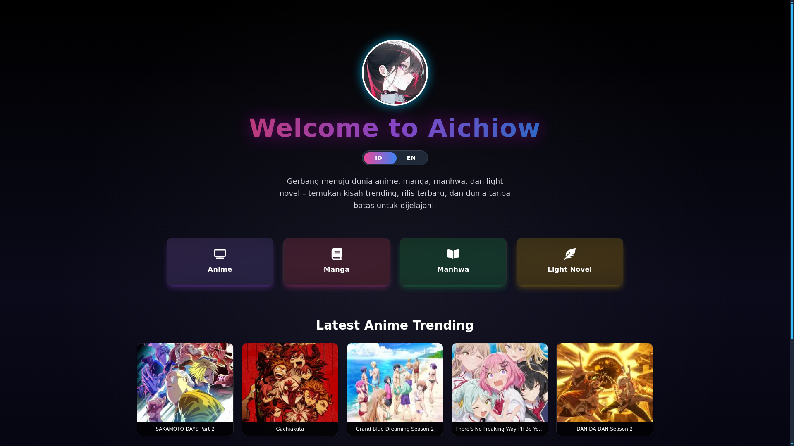
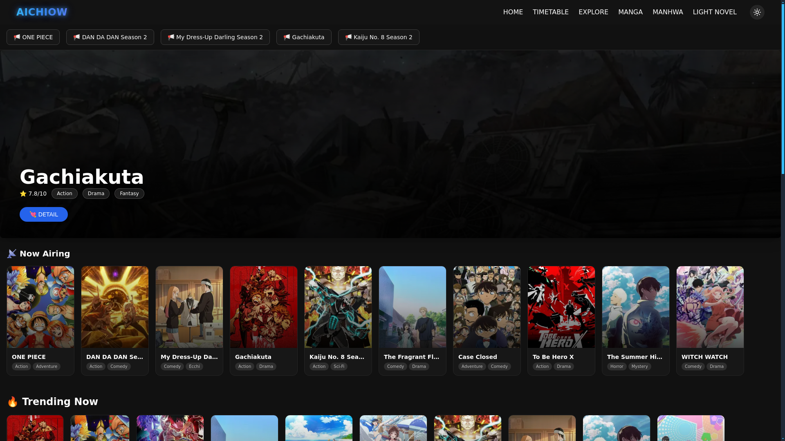
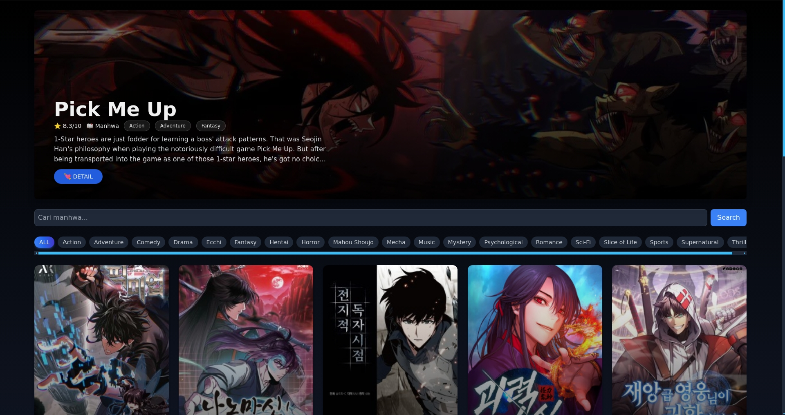
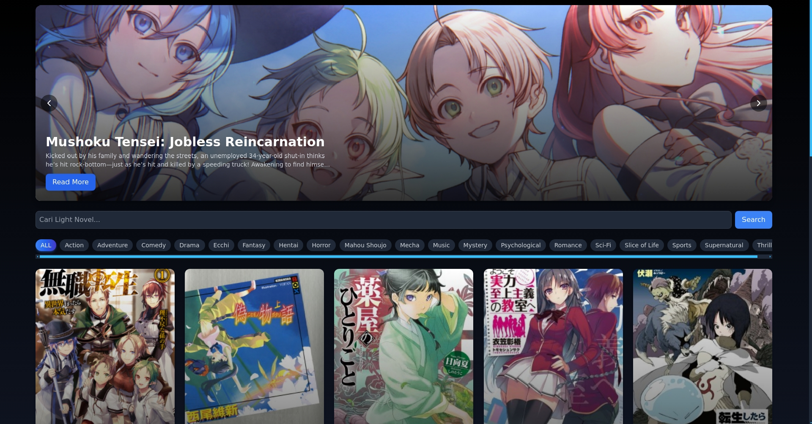

# Aichiow

Discover anime, manga, manhwa, and light novels on **Aichiow** — modern design, fast navigation, and rich details in one place.

---

## 🚀 Features
- **Landing Page:** Modern and responsive design.
- **Anime:** Trending titles, official trailers, and detailed character info.
- **Manga & Manhwa:** Seamless reader, genre filters, and discovery tools.
- **Light Novels:** Smooth browsing with hero sliders.
- **Fast Navigation:** Optimized for mobile and desktop.
- **Search & Filter:** Quickly find what you love.

---

## 📸 Screenshots

### Landing Page


### Anime (Home)


### Manga *(Coming Soon)*


### Manhwa


### Light Novels


---

## 🛠 Tech Stack
- **Next.js 13**  
- **TypeScript**  
- **Tailwind CSS**  
- **Framer Motion**  
- **AniList & MangaDex API**  

---

## 🌐 Live Demo
[**Visit Aichiow**](https://aichiow.vercel.app/)

---

## 📦 Installation
```bash
# Clone the repository
git clone https://github.com/username/aichiow.git

# Navigate into the project
cd aichiow

# Install dependencies
npm install

# Run the development server
npm run dev
