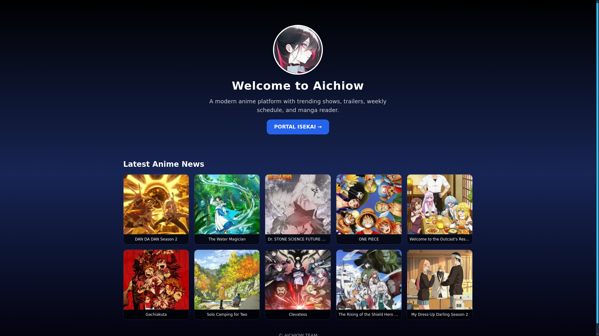

# 🌌 Aichiow

**Aichiow** is a modern web streaming platform for anime and manga lovers, featuring the latest anime info, new manga releases, trailers, airing schedules, and advanced search. Inspired by Crunchyroll and LiveChart, Aichiow is built with Next.js 13, TailwindCSS, and GraphQL API from Anilist & MangaDex.

## PREVIEW  


## 🚀 Key Features

### 🎬 Anime
- Anime detail pages with cover, trailer, studio, genres, score, and description  
- Main character and voice actor (seiyuu) info  
- YouTube trailer support  

### 🔥 Trending & Popular
- Daily trending anime (TRENDING_DESC) from Anilist  
- Ongoing & seasonal anime display  

### ⏳ Upcoming & Schedule
- Upcoming anime that haven’t aired (`NOT_YET_RELEASED`)  
- Weekly release schedule with airing time  
- Fully integrated on `/upcoming` page  

### 📚 Manga
- Data powered by MangaDex API  
- Manga detail pages with description, cover, and chapters  
- Character and seiyuu info (if available)  
- Built-in manga reader to read chapters directly  

### 🧭 Explore & Search
- Explore page with anime categories and filters  
- Global search page (`/search`) with modern UI  
- Autocomplete support (coming soon)  

### 🎨 UI/UX
- Anime-modern, elegant, and mobile-friendly design  
- Dark mode support  
- Blazing-fast routing with Next.js App Router  

## 🧩 Tech Stack

- **Next.js 13** – App Router, Client Components  
- **TailwindCSS** – modern utility-first styling  
- **Anilist GraphQL API** – anime data  
- **MangaDex REST API** – manga data  
- **SWR** – fetching & caching data  
- **Vercel** – hosting and deployment  

## 🧪 Upcoming Features
- [ ] Bookmark system (anime/manga)  
- [ ] Continue Watching  
- [ ] Anime episode tracker  
- [ ] Genre-specific pages  
- [ ] Admin dashboard (for analytics/statistics)  

## 🔗 Live Demo  
🌐 https://aichiow.vercel.app  

Built with ❤️ by !Taka  
Powered by Anilist & MangaDex APIs.

---

## 📦 Local Installation

```bash
git clone https://github.com/username/Aichiow.git
cd Aichiow
npm install
npm run dev
